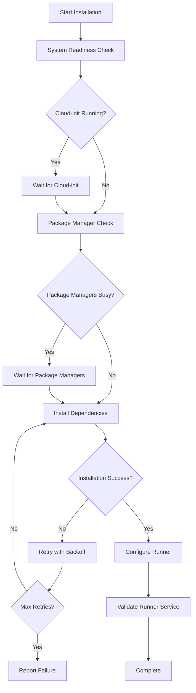

# Design Document

## Overview

This design addresses the package management conflicts during GitHub Actions runner installation by implementing robust waiting mechanisms, system state validation, and enhanced error handling. The solution ensures reliable runner installation even when EC2 instances are running background updates or cloud-init processes.

## Architecture

The enhanced installation process follows a multi-stage approach:



## Components and Interfaces

### 1. System Readiness Validator

**Purpose:** Validates that the EC2 instance is ready for runner installation

**Functions:**
- `check_cloud_init_status()` - Checks if cloud-init is complete
- `wait_for_cloud_init()` - Waits for cloud-init with timeout
- `validate_system_resources()` - Checks disk space and memory
- `check_network_connectivity()` - Validates GitHub connectivity

**Interface:**
```bash
validate_system_readiness() {
    local timeout=${1:-600}  # 10 minutes default
    # Returns 0 if ready, 1 if timeout, 2 if error
}
```

### 2. Package Manager Monitor

**Purpose:** Monitors and waits for package management processes

**Functions:**
- `check_package_managers()` - Identifies running package managers
- `wait_for_package_managers()` - Waits for processes to complete
- `get_lock_holders()` - Identifies processes holding dpkg locks
- `estimate_wait_time()` - Estimates completion time

**Interface:**
```bash
wait_for_package_managers() {
    local timeout=${1:-300}  # 5 minutes default
    local check_interval=${2:-10}  # 10 seconds default
    # Returns 0 if clear, 1 if timeout
}
```

### 3. Installation Manager

**Purpose:** Handles runner installation with retry logic

**Functions:**
- `install_runner_dependencies()` - Installs required packages
- `download_runner()` - Downloads GitHub Actions runner
- `configure_runner()` - Configures runner with repository
- `validate_installation()` - Verifies installation success

**Interface:**
```bash
install_runner_with_retry() {
    local max_retries=${1:-3}
    local base_delay=${2:-30}
    # Returns 0 if success, 1 if failure
}
```

### 4. Progress Reporter

**Purpose:** Provides user feedback during installation

**Functions:**
- `show_progress()` - Displays progress indicators
- `log_status()` - Logs status messages
- `show_wait_message()` - Shows what the system is waiting for
- `display_troubleshooting()` - Shows troubleshooting information

**Interface:**
```bash
show_progress() {
    local message="$1"
    local current_step="$2"
    local total_steps="$3"
}
```

## Data Models

### System State
```bash
SYSTEM_STATE = {
    cloud_init_complete: boolean
    package_managers_busy: boolean
    disk_space_available: integer (MB)
    memory_available: integer (MB)
    network_connectivity: boolean
    last_check_time: timestamp
}
```

### Installation Context
```bash
INSTALLATION_CONTEXT = {
    repository_url: string
    runner_name: string
    registration_token: string
    max_retries: integer
    current_retry: integer
    installation_start_time: timestamp
    last_error: string
}
```

### Package Manager Status
```bash
PACKAGE_STATUS = {
    apt_running: boolean
    dpkg_locked: boolean
    lock_holders: array[process_id]
    estimated_completion: timestamp
    update_in_progress: boolean
}
```

## Error Handling

### Error Categories

1. **System Not Ready Errors**
   - Cloud-init still running
   - Insufficient disk space
   - Network connectivity issues
   - System resource constraints

2. **Package Management Errors**
   - dpkg lock conflicts
   - apt process conflicts
   - Package installation failures
   - Dependency resolution issues

3. **Runner Configuration Errors**
   - Registration token expired
   - Network connectivity to GitHub
   - Permission issues
   - Service startup failures

### Error Recovery Strategies

1. **Automatic Retry with Backoff**
   ```bash
   retry_delay = base_delay * (2 ^ retry_count)
   max_delay = 300  # 5 minutes
   ```

2. **Graceful Degradation**
   - Skip optional dependencies if critical ones succeed
   - Use alternative installation methods
   - Provide manual installation instructions

3. **User Guidance**
   - Clear error messages with context
   - Specific troubleshooting steps
   - Links to documentation

## Testing Strategy

### Unit Tests
- System readiness validation functions
- Package manager monitoring logic
- Retry mechanism behavior
- Error handling scenarios

### Integration Tests
- Full installation process on clean EC2 instance
- Installation during system updates
- Installation with various system states
- Network connectivity edge cases

### End-to-End Tests
- Complete runner setup workflow
- Runner registration and service startup
- Multi-repository runner configurations
- Cleanup and resource management

### Test Scenarios

1. **Happy Path**
   - Clean system, no conflicts
   - Successful installation and registration

2. **System Update Conflicts**
   - Installation during automatic updates
   - Multiple package managers running
   - dpkg lock conflicts

3. **Resource Constraints**
   - Low disk space scenarios
   - Limited memory conditions
   - Network connectivity issues

4. **Edge Cases**
   - Cloud-init timeout scenarios
   - Registration token expiration
   - Service startup failures

## Implementation Plan

### Phase 1: System Readiness Validation
- Implement cloud-init status checking
- Add system resource validation
- Create network connectivity tests

### Phase 2: Package Manager Monitoring
- Implement package manager detection
- Add waiting mechanisms with progress
- Create lock holder identification

### Phase 3: Enhanced Installation Process
- Add retry logic with exponential backoff
- Implement progress reporting
- Create comprehensive error handling

### Phase 4: Testing and Validation
- Create comprehensive test suite
- Validate on various EC2 instance types
- Test with different Ubuntu versions

## Security Considerations

- Validate all external downloads
- Use secure communication channels
- Implement proper error message sanitization
- Ensure no sensitive information in logs
- Validate system permissions before installation

## Performance Considerations

- Minimize system resource usage during waiting
- Optimize check intervals to balance responsiveness and system load
- Use efficient process monitoring techniques
- Implement timeout mechanisms to prevent indefinite waiting

## Monitoring and Observability

- Log all installation steps with timestamps
- Track installation success/failure rates
- Monitor system resource usage during installation
- Provide detailed progress information to users
- Create metrics for troubleshooting common issues